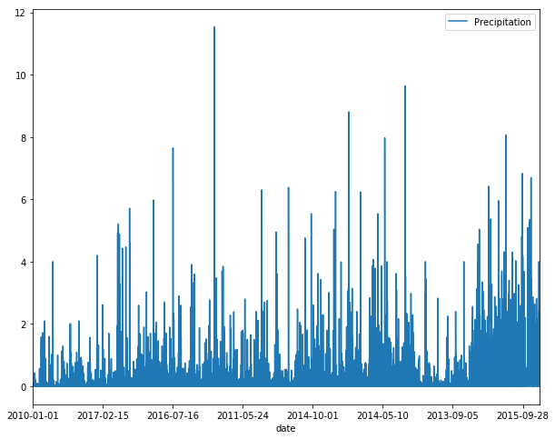
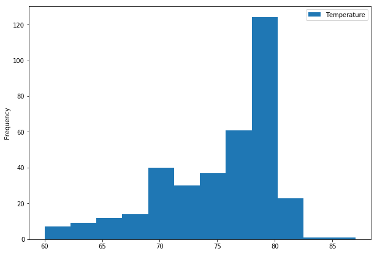
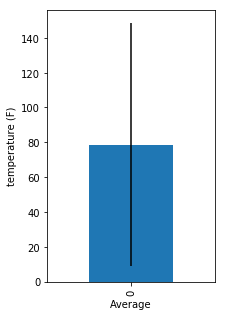

```python
import sqlalchemy
from sqlalchemy.ext.automap import automap_base
from sqlalchemy.orm import Session
from sqlalchemy import create_engine
import pandas as pd
```


```python
from sqlalchemy.orm import Session
engine = create_engine("sqlite:///hawaii.sqlite")
session = Session(bind=engine)
conn = engine.connect()
```


```python
Base = automap_base()
```


```python
Base.prepare(engine, reflect=True)
```


```python
Base.classes.keys()
```


    []


```python
session = Session(engine)
```


```python
measures_sql = pd.read_sql("SELECT * FROM Measurement",conn)
measures_sql.head()
```


<div>
<style>
    .dataframe thead tr:only-child th {
        text-align: right;
    }

    .dataframe thead th {
        text-align: left;
    }

    .dataframe tbody tr th {
        vertical-align: top;
    }
</style>
<table border="1" class="dataframe">
  <thead>
    <tr style="text-align: right;">
      <th></th>
      <th>measurement_id</th>
      <th>station</th>
      <th>date</th>
      <th>prcp</th>
      <th>tobs</th>
    </tr>
  </thead>
  <tbody>
    <tr>
      <th>0</th>
      <td>1</td>
      <td>USC00519397</td>
      <td>2010-01-01</td>
      <td>0.08</td>
      <td>65.0</td>
    </tr>
    <tr>
      <th>1</th>
      <td>2</td>
      <td>USC00519397</td>
      <td>2010-01-02</td>
      <td>0.00</td>
      <td>63.0</td>
    </tr>
    <tr>
      <th>2</th>
      <td>3</td>
      <td>USC00519397</td>
      <td>2010-01-03</td>
      <td>0.00</td>
      <td>74.0</td>
    </tr>
    <tr>
      <th>3</th>
      <td>4</td>
      <td>USC00519397</td>
      <td>2010-01-04</td>
      <td>0.00</td>
      <td>76.0</td>
    </tr>
    <tr>
      <th>4</th>
      <td>6</td>
      <td>USC00519397</td>
      <td>2010-01-07</td>
      <td>0.06</td>
      <td>70.0</td>
    </tr>
  </tbody>
</table>
</div>


```python
station_sql = pd.read_sql("SELECT * FROM Station",conn)
```


```python
measures_prcp = measures_sql.loc[:,('date', 'prcp' )]
measures_prcp.columns
```


    Index(['date', 'prcp'], dtype='object')


```python
import matplotlib.pyplot as plt
```


```python
ax = measures_prcp.plot('date', 'prcp', figsize=(10,8))
ax.legend(["Precipitation"])
plt.show()
```





```python
# print the summary statistics for the precipitation data.
measures_prcp['prcp'].describe()
```


    count    18103.000000
    mean         0.160644
    std          0.468746
    min          0.000000
    25%          0.000000
    50%          0.010000
    75%          0.110000
    max         11.530000
    Name: prcp, dtype: float64


```python
station_sql.head()
```


<div>
<style>
    .dataframe thead tr:only-child th {
        text-align: right;
    }

    .dataframe thead th {
        text-align: left;
    }

    .dataframe tbody tr th {
        vertical-align: top;
    }
</style>
<table border="1" class="dataframe">
  <thead>
    <tr style="text-align: right;">
      <th></th>
      <th>station_id</th>
      <th>station</th>
      <th>name</th>
      <th>latitude</th>
      <th>longitude</th>
      <th>elevation</th>
      <th>location</th>
    </tr>
  </thead>
  <tbody>
    <tr>
      <th>0</th>
      <td>1</td>
      <td>USC00519397</td>
      <td>WAIKIKI 717.2, HI US</td>
      <td>21.2716</td>
      <td>-157.8168</td>
      <td>3.0</td>
      <td>POINT(21.2716 -157.8168)</td>
    </tr>
    <tr>
      <th>1</th>
      <td>2</td>
      <td>USC00513117</td>
      <td>KANEOHE 838.1, HI US</td>
      <td>21.4234</td>
      <td>-157.8015</td>
      <td>14.6</td>
      <td>POINT(21.4234 -157.8015)</td>
    </tr>
    <tr>
      <th>2</th>
      <td>3</td>
      <td>USC00514830</td>
      <td>KUALOA RANCH HEADQUARTERS 886.9, HI US</td>
      <td>21.5213</td>
      <td>-157.8374</td>
      <td>7.0</td>
      <td>POINT(21.5213 -157.8374)</td>
    </tr>
    <tr>
      <th>3</th>
      <td>4</td>
      <td>USC00517948</td>
      <td>PEARL CITY, HI US</td>
      <td>21.3934</td>
      <td>-157.9751</td>
      <td>11.9</td>
      <td>POINT(21.3934 -157.9751)</td>
    </tr>
    <tr>
      <th>4</th>
      <td>5</td>
      <td>USC00518838</td>
      <td>UPPER WAHIAWA 874.3, HI US</td>
      <td>21.4992</td>
      <td>-158.0111</td>
      <td>306.6</td>
      <td>POINT(21.4992 -158.0111)</td>
    </tr>
  </tbody>
</table>
</div>


```python
# calculate the total number of stations
measures_sql['station'].nunique()
```


    9


```python
# List the stations and observation counts in descending order
measures_sql['station'].value_counts()
```


    USC00519281    2772
    USC00513117    2696
    USC00519397    2685
    USC00519523    2572
    USC00516128    2484
    USC00514830    1937
    USC00511918    1932
    USC00517948     683
    USC00518838     342
    Name: station, dtype: int64


```python
# Design a query to retrieve the last 12 months of temperature observation data (tobs)
measures_tobs = measures_sql.loc[:,('date', 'station', 'tobs')]
measures_tobs.columns
```


    Index(['date', 'station', 'tobs'], dtype='object')


```python
measures_tobs_last12 = measures_tobs[measures_tobs['date']>='2016-08-23']
measures_tobs_last12.head()
```


<div>
<style>
    .dataframe thead tr:only-child th {
        text-align: right;
    }

    .dataframe thead th {
        text-align: left;
    }

    .dataframe tbody tr th {
        vertical-align: top;
    }
</style>
<table border="1" class="dataframe">
  <thead>
    <tr style="text-align: right;">
      <th></th>
      <th>date</th>
      <th>station</th>
      <th>tobs</th>
    </tr>
  </thead>
  <tbody>
    <tr>
      <th>2326</th>
      <td>2016-08-23</td>
      <td>USC00519397</td>
      <td>81.0</td>
    </tr>
    <tr>
      <th>2327</th>
      <td>2016-08-24</td>
      <td>USC00519397</td>
      <td>79.0</td>
    </tr>
    <tr>
      <th>2328</th>
      <td>2016-08-25</td>
      <td>USC00519397</td>
      <td>80.0</td>
    </tr>
    <tr>
      <th>2329</th>
      <td>2016-08-26</td>
      <td>USC00519397</td>
      <td>79.0</td>
    </tr>
    <tr>
      <th>2330</th>
      <td>2016-08-27</td>
      <td>USC00519397</td>
      <td>77.0</td>
    </tr>
  </tbody>
</table>
</div>


```python
measures_tobs_last12.shape
```


    (2021, 3)


```python
measures_tobs_last12['station'].value_counts()
```


    USC00519397    359
    USC00519281    352
    USC00513117    343
    USC00516128    328
    USC00519523    314
    USC00514830    265
    USC00517948     60
    Name: station, dtype: int64


```python
"""USC00519397 is the station with the highest number of observations"""
```


    'USC00519397 is the station with the highest number of observations'


```python
measures_tobs_last12_highest = measures_tobs_last12[measures_tobs_last12['station']=="USC00519397"]
measures_tobs_last12_highest.head()
```


<div>
<style>
    .dataframe thead tr:only-child th {
        text-align: right;
    }

    .dataframe thead th {
        text-align: left;
    }

    .dataframe tbody tr th {
        vertical-align: top;
    }
</style>
<table border="1" class="dataframe">
  <thead>
    <tr style="text-align: right;">
      <th></th>
      <th>date</th>
      <th>station</th>
      <th>tobs</th>
    </tr>
  </thead>
  <tbody>
    <tr>
      <th>2326</th>
      <td>2016-08-23</td>
      <td>USC00519397</td>
      <td>81.0</td>
    </tr>
    <tr>
      <th>2327</th>
      <td>2016-08-24</td>
      <td>USC00519397</td>
      <td>79.0</td>
    </tr>
    <tr>
      <th>2328</th>
      <td>2016-08-25</td>
      <td>USC00519397</td>
      <td>80.0</td>
    </tr>
    <tr>
      <th>2329</th>
      <td>2016-08-26</td>
      <td>USC00519397</td>
      <td>79.0</td>
    </tr>
    <tr>
      <th>2330</th>
      <td>2016-08-27</td>
      <td>USC00519397</td>
      <td>77.0</td>
    </tr>
  </tbody>
</table>
</div>


```python
ax = measures_tobs_last12_highest.plot.hist('temperature', bins=12, figsize =(10,7))
ax.legend(["Temperature"])
plt.show()
```





```python
# Temperature Analysis
def calc_temps(df, start_date, end_date):
    
    chunk = df[(df['date'] >= start_date) & (df['date'] <= end_date)]
    min_temp = chunk['tobs'].min()
    max_temp = chunk['tobs'].max()
    avg_temp = chunk['tobs'].mean()
    return min_temp, max_temp, avg_temp
```


```python
result = calc_temps(measures_sql, "2017-08-10", "2017-08-23")
result
```


    (70.0, 84.0, 78.65306122448979)


```python
result_list = list(result)
```


```python
result_df = pd.DataFrame({'min' : result_list[0], 'max': result_list[1], 'average': result_list[2]}, index=[0])
result_df
```


<div>
<style>
    .dataframe thead tr:only-child th {
        text-align: right;
    }

    .dataframe thead th {
        text-align: left;
    }

    .dataframe tbody tr th {
        vertical-align: top;
    }
</style>
<table border="1" class="dataframe">
  <thead>
    <tr style="text-align: right;">
      <th></th>
      <th>average</th>
      <th>max</th>
      <th>min</th>
    </tr>
  </thead>
  <tbody>
    <tr>
      <th>0</th>
      <td>78.653061</td>
      <td>84.0</td>
      <td>70.0</td>
    </tr>
  </tbody>
</table>
</div>


```python
ax = result_df['average'].plot(kind='bar', yerr=[result_df['min'],result_df['max']], figsize =(3,5) )
ax.set_ylabel('temperature (F)')
ax.set_xlabel("Average")
plt.show()
```




